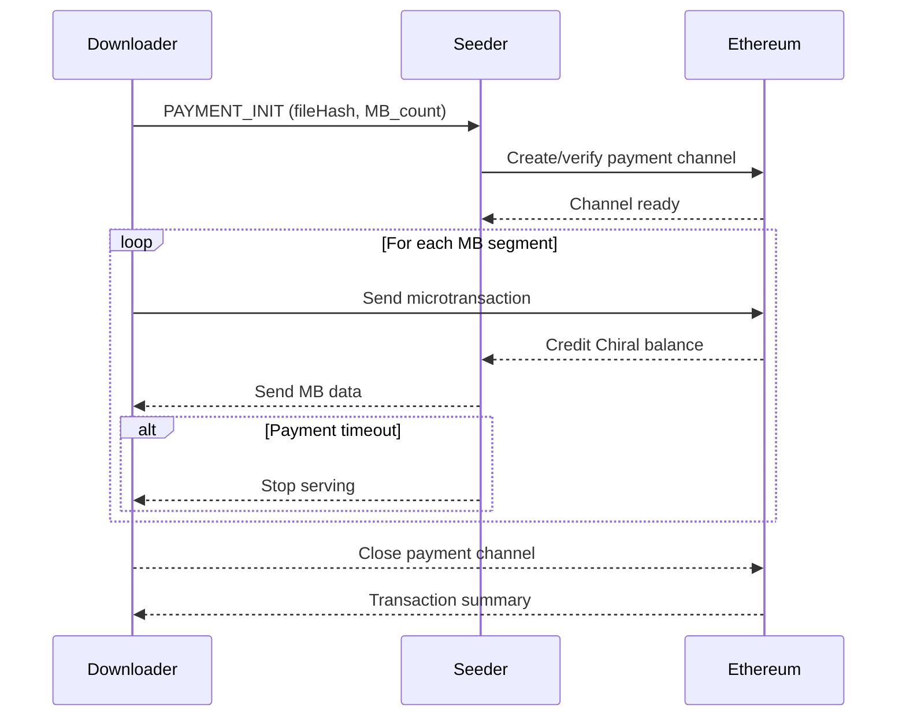

# The Chiral Network Design Manual

**A Comprehensive Technical Reference for the Chiral Network P2P File Sharing System**

*Version 1.0 | January 2026*

---

## Table of Contents

- [Part I: Introduction](#part-i-introduction)
  - [Chapter 1: Project Overview](#chapter-1-project-overview)
  - [Chapter 2: Core Design Principles](#chapter-2-core-design-principles)
  - [Chapter 3: Technology Stack](#chapter-3-technology-stack)
- [Part II: System Architecture](#part-ii-system-architecture)
  - [Chapter 4: Decoupled Architecture](#chapter-4-decoupled-architecture)
  - [Chapter 5: Network Layers](#chapter-5-network-layers)
  - [Chapter 6: Protocol Manager & Content Protocols](#chapter-6-protocol-manager--content-protocols)
- [Part III: Network Infrastructure](#part-iii-network-infrastructure)
  - [Chapter 7: DHT & Peer Discovery](#chapter-7-dht--peer-discovery)
  - [Chapter 8: NAT Traversal](#chapter-8-nat-traversal)
  - [Chapter 9: Data Transfer Protocols](#chapter-9-data-transfer-protocols)
- [Part IV: File Sharing System](#part-iv-file-sharing-system)
  - [Chapter 10: File Processing Pipeline](#chapter-10-file-processing-pipeline)
  - [Chapter 11: Seeding & Downloading](#chapter-11-seeding--downloading)
  - [Chapter 12: Multi-Source Downloads](#chapter-12-multi-source-downloads)
- [Part V: Blockchain & Payments](#part-v-blockchain--payments)
  - [Chapter 13: Blockchain Infrastructure](#chapter-13-blockchain-infrastructure)
  - [Chapter 14: Wallet System](#chapter-14-wallet-system)
  - [Chapter 15: Payment Protocol](#chapter-15-payment-protocol)
- [Part VI: Reputation System](#part-vi-reputation-system)
  - [Chapter 16: Trust Architecture](#chapter-16-trust-architecture)
  - [Chapter 17: Signed Transaction Messages](#chapter-17-signed-transaction-messages)
  - [Chapter 18: Complaint & Dispute Resolution](#chapter-18-complaint--dispute-resolution)
- [Part VII: Security & Privacy](#part-vii-security--privacy)
  - [Chapter 19: Cryptographic Foundations](#chapter-19-cryptographic-foundations)
  - [Chapter 20: File Security](#chapter-20-file-security)
  - [Chapter 21: Privacy Features](#chapter-21-privacy-features)
- [Part VIII: User Interface](#part-viii-user-interface)
  - [Chapter 22: Application Pages](#chapter-22-application-pages)
  - [Chapter 23: State Management](#chapter-23-state-management)
  - [Chapter 24: Component Architecture](#chapter-24-component-architecture)
- [Part IX: Deployment & Operations](#part-ix-deployment--operations)
  - [Chapter 25: Installation & Setup](#chapter-25-installation--setup)
  - [Chapter 26: Configuration Reference](#chapter-26-configuration-reference)
  - [Chapter 27: Diagnostics & Troubleshooting](#chapter-27-diagnostics--troubleshooting)
- [Appendices](#appendices)
  - [Appendix A: Technical Specifications](#appendix-a-technical-specifications)
  - [Appendix B: API Reference](#appendix-b-api-reference)
  - [Appendix C: Error Codes](#appendix-c-error-codes)
  - [Appendix D: Glossary](#appendix-d-glossary)

---

# Part I: Introduction

## Chapter 1: Project Overview

### 1.1 What is Chiral Network?

Chiral Network is a **decentralized peer-to-peer file sharing application** that combines blockchain technology with distributed hash table (DHT) based file discovery. It implements a BitTorrent-like continuous seeding model where files are instantly available to the network, with a strong focus on privacy, security, and legitimate use cases.

### 1.2 Key Innovation: Decoupled Architecture

The fundamental innovation of Chiral Network is the **complete decoupling of payment mechanisms from data transfer protocols**. This separation enables:

- **Protocol Flexibility**: Support for HTTP, WebTorrent, BitTorrent, and ed2k protocols
- **Payment Consistency**: Same payment logic regardless of transfer protocol
- **Independent Evolution**: Update payment or transfer systems independently
- **Broad Compatibility**: Use proven protocols without modification

### 1.3 Project Goals

| Goal                    | Description                                                         |
| ----------------------- | ------------------------------------------------------------------- |
| **Decentralization**    | No centralized servers - all peer discovery via DHT                 |
| **Economic Incentives** | Seeders earn cryptocurrency for sharing files                       |
| **Privacy-First**       | Circuit Relay v2, AutoNAT v2, SOCKS5 proxy support                  |
| **Legitimate Use**      | Designed for personal, educational, and organizational file sharing |
| **Non-Commercial**      | No marketplace, pricing, or trading features                        |

### 1.4 What Chiral Network is NOT

To maintain focus and legal compliance, Chiral Network explicitly does not implement:

- ❌ Global file search/discovery (could enable piracy)
- ❌ Marketplace or trading features
- ❌ VPN or general anonymity network functionality
- ❌ Content recommendations or social features
- ❌ Exit node functionality for non-P2P traffic

---

## Chapter 2: Core Design Principles

### 2.1 Fully Decentralized P2P

All peer discovery happens through the Kademlia DHT. There are no centralized servers, trackers, or coordinators. Every node is an equal participant that can simultaneously seed, download, relay traffic, and mine blocks.

### 2.2 BitTorrent-Style Sharing

Files follow the BitTorrent model:

- **Instant Seeding**: Files become available immediately when added
- **No Upload Step**: No "upload to server" process
- **Continuous Availability**: Files available while seeder is online
- **No Permanent Storage**: Files disappear when all seeders go offline

### 2.3 Protocol-Agnostic Payments

Payment transactions are identical regardless of whether data was transferred via HTTP, WebTorrent, BitTorrent, or ed2k. The blockchain layer processes payments independently of the data transfer layer.

### 2.4 Equal Peers Model

All nodes are equal peers. There are no special roles:

- Any node can seed files and earn payments
- Any node can download files and pay seeders
- Any node can enable relay mode to help NAT'd peers
- Any node can participate in mining

---

## Chapter 3: Technology Stack

### 3.1 Frontend

| Technology        | Purpose                                   |
| ----------------- | ----------------------------------------- |
| **Svelte 5**      | Reactive UI framework with runes          |
| **TypeScript**    | Type-safe development                     |
| **Tailwind CSS**  | Utility-first styling                     |
| **Bits UI**       | Accessible component primitives           |
| **svelte-i18n**   | Internationalization (EN, ES, RU, ZH, KO) |
| **Lucide Svelte** | Icon library                              |
| **mode-watcher**  | Dark/light mode support                   |

### 3.2 Desktop Integration

| Technology             | Purpose                      |
| ---------------------- | ---------------------------- |
| **Tauri 2**            | Rust-based desktop runtime   |
| **Native File System** | OS-level file operations     |
| **System Tray**        | Background operation support |

### 3.3 P2P Network Infrastructure

| Technology         | Purpose                                  |
| ------------------ | ---------------------------------------- |
| **libp2p v0.54**   | Full P2P networking stack (Rust backend) |
| **Kademlia DHT**   | File discovery with minimal records      |
| **WebRTC**         | Direct peer-to-peer data channels        |
| **Noise Protocol** | Cryptographic transport security         |

### 3.4 NAT Traversal

| Technology           | Purpose                                 |
| -------------------- | --------------------------------------- |
| **AutoNAT v2**       | Reachability detection                  |
| **Circuit Relay v2** | Traffic forwarding for NAT'd peers      |
| **DCUtR**            | Direct Connection Upgrade through Relay |
| **mDNS**             | Local peer discovery                    |
| **UPnP**             | Automatic port forwarding               |

### 3.5 Blockchain & Security

| Technology           | Purpose                      |
| -------------------- | ---------------------------- |
| **Geth Integration** | Ethereum node operations     |
| **HD Wallets**       | BIP32, BIP39, secp256k1      |
| **AES-256-GCM**      | File encryption              |
| **PBKDF2**           | Key derivation               |
| **Clef**             | External transaction signing |

---

# Part II: System Architecture

## Chapter 4: Decoupled Architecture

### 4.1 Architecture Overview

```
┌─────────────────────────────────────────────────────────┐
│                    Application Layer                     │
│             (File Management, User Interface)            │
└─────────────────────────────────────────────────────────┘
                              │
        ┌─────────────────────┴─────────────────────┐
        │                                           │
┌───────▼──────────────┐              ┌────────────▼────────┐
│  Payment Layer       │              │ Data Transfer Layer │
│  (Blockchain)        │              │  (Protocols)        │
│                      │              │                     │
│  • ETH-compatible    │◄─────────────┤  • HTTP             │
│  • Payment contracts │  Settlement  │  • WebRTC           │
│  • Mining rewards    │              │  • BitTorrent       │
│  • Gas fees          │              │  • ed2k             │
│                      │              │  • FTP              │
└──────────────────────┘              └─────────────────────┘
```

### 4.2 Why Decoupling Matters

1. **Protocol Flexibility**: Add new protocols without changing payment logic
2. **Independent Evolution**: Upgrade payment mechanisms without touching data transfer code
3. **Legacy Protocol Support**: Use established protocols without modification
4. **Choice**: Users select best protocol while payments remain consistent
5. **Testing**: Test data transfer and payments independently

---

## Chapter 5: Network Layers

### 5.1 Five-Tier Architecture

```
Tier 1: Client Applications
├─ Desktop GUI (Svelte 5 + Tauri 2)
├─ CLI (headless mode)
└─ Web Browser (limited support)

Tier 2: Service Layer
├─ File Service (chunking, assembly)
├─ Wallet Service (payment management)
├─ Protocol Manager (upload/download interface)
├─ Network Service (libp2p integration)
├─ DHT Service (Kademlia discovery)
├─ Reputation Service (peer scoring)
├─ Payment Service (blockchain interaction)
└─ Bandwidth Scheduler (rate limiting)

Tier 3: Network Layer
├─ libp2p v0.54 (P2P stack)
├─ Kademlia DHT (file discovery)
├─ Gossipsub (seeder & file information)
├─ Noise Protocol (encryption)
├─ Circuit Relay v2 (NAT traversal)
├─ AutoNAT v2 (reachability detection)
├─ WebRTC (P2P data channels)
└─ Bootstrap Nodes (peer discovery)

Tier 4: Blockchain Layer
├─ Ethereum-compatible network
├─ Geth integration
├─ Proof-of-Work consensus
└─ Smart contract support

Tier 5: Storage Layer
├─ Local file cache
├─ Block store (chunk storage)
└─ Minimal DHT records (file discovery)
```

### 5.2 Service Responsibilities

| Service                | Responsibility                                                     |
| ---------------------- | ------------------------------------------------------------------ |
| **FileService**        | File chunking, assembly, versioning                                |
| **WalletService**      | Key management, transaction signing                                |
| **ProtocolManager**    | Protocol selection and abstracts protocol specific upload/download |
| **NetworkService**     | P2P connection management                                          |
| **DHTService**         | Kademlia DHT operations                                            |
| **ReputationService**  | Peer scoring and trust levels                                      |
| **PaymentService**     | Blockchain transaction handling                                    |
| **BandwidthScheduler** | Time-based rate limiting                                           |

---

## Chapter 6: Protocol Manager & Content Protocols

### 6.1 IContentProtocol Interface

All content protocols implement this unified interface:

```typescript
interface IContentProtocol {
  getName(): Protocol;
  getPeersServing(identification: FileIdentification): Promise<PeerInfo[]>;
  getContentFrom(
    peerId: string,
    identification: FileIdentification,
    progressUpdate: ProgressUpdate,
    outputPath?: string,
  ): Promise<DownloadResult>;
  uploadFile(
    options: UploadOptions,
    progressUpdate: ProgressUpdate,
  ): Promise<UploadResult>;
  startSeeding(
    filePathOrData: string | Uint8Array,
    progressUpdate: ProgressUpdate,
  ): Promise<UploadResult>;
  stopSeeding(identification: FileIdentification): Promise<boolean>;
  pauseDownload(identification: FileIdentification): Promise<boolean>;
  resumeDownload(identification: FileIdentification): Promise<boolean>;
  cancelDownload(identification: FileIdentification): Promise<boolean>;
}
```

### 6.2 ProtocolManager Class

The ProtocolManager orchestrates protocol interactions and delegates to registered (src/lib/services/contentProtocols/index.ts) implementations:

| Method                         | Description                                    |
| ------------------------------ | ---------------------------------------------- |
| `getProtocolImpl(protocol)`   | Get protocol implementation                     |
| `getPeersServing(..)`          | List available peers for a protocol            |
| `downloadFile(..)`             | Download via protocol in identification        |
| `uploadFile(..)`               | Upload/seed via requested protocol             |
| `stopSharing(..)`              | Stop seeding content                           |
| `pauseDownload(..)`            | Pause an in-progress download                  |
| `resumeDownload(..)`           | Resume a paused download                       |
| `cancelDownload(..)`           | Cancel an in-progress download                 |
| `cleanup()`                    | Clean shutdown of all protocols                |

### 6.3 Default Protocol Selection

```
Network Capability              → Default Seeding Protocol
───────────────────────────────────────────────────────────
Public IP                       → HTTP
Behind NAT + UPnP Available     → HTTP (auto port forward)
Behind NAT + UPnP Failed        → WebTorrent
Browser Only                    → WebTorrent (only option)
```

---

# Part III: Network Infrastructure

## Chapter 7: DHT & Peer Discovery

### 7.1 Kademlia Parameters

| Parameter             | Value    | Description           |
| --------------------- | -------- | --------------------- |
| **K**                 | 20       | Bucket size           |
| **α**                 | 3        | Concurrency parameter |
| **Key Space**         | 160 bits | Node ID size          |
| **Refresh Interval**  | 3600s    | Bucket refresh time   |
| **Record Expiration** | 86400s   | TTL for records       |

### 7.2 DHT Operations

| Operation      | Timeout | Retries | Description     |
| -------------- | ------- | ------- | --------------- |
| **PING**       | 5s      | 3       | Liveness check  |
| **FIND_NODE**  | 10s     | 3       | Node discovery  |
| **FIND_VALUE** | 10s     | 5       | Value lookup    |
| **STORE**      | 10s     | 3       | Store key-value |

### 7.3 Minimal DHT File Record

For file metadata, the DHT is used only for basic file info retrieval and provider lookup. Each file hash key
stores a minimal record so the UI can display basic file information while seeder
identity, pricing, and protocol details are exchanged via GossipSub.

```typescript
export interface DhtFileRecord {
  fileHash: string;
  fileName: string;
  fileSize: number; // bytes
  createdAt: number; // Unix timestamp
  mimeType?: string;
}
```

### 7.4 Seeder General Info (GossipSub)

Seeder identity and pricing are broadcast on a per-seeder topic:
`seeder/{peerId}`.

```typescript
export interface SeederGeneralInfo {
  peerId: string;
  walletAddress: string;
  defaultPricePerMb: number;
  timestamp: number;
}
```

### 7.5 Seeder File Info (GossipSub)

File-specific protocol support and pricing overrides are broadcast on:
`seeder/{peerId}/file/{fileHash}`.

```typescript
export interface SeederFileInfo {
  peerId: string;
  fileHash: string;
  pricePerMb?: number; // Overrides defaultPricePerMb if set
  supportedProtocols: Protocol[];
  protocolDetails: ProtocolDetails;
  timestamp: number;
}
```

### 7.6 Protocol Details Types

Protocol detail payloads are defined per protocol and carried in
`SeederFileInfo.protocolDetails`.

```typescript
import { Protocol } from "$lib/services/contentProtocols/types";

export type ProtocolDetailsByProtocol = {
  [Protocol.HTTP]: HttpProtocolDetails;
  [Protocol.FTP]: FtpProtocolDetails;
  [Protocol.ED2K]: Ed2kProtocolDetails;
  [Protocol.BitTorrent]: BitTorrentProtocolDetails;
  [Protocol.WebRTC]: WebRtcProtocolDetails;
  [Protocol.UNKNOWN]: never;
};

export type ProtocolDetails = Partial<ProtocolDetailsByProtocol>;
```

---

## Chapter 8: NAT Traversal

### 8.1 Three-Layer Approach

**Layer 1: Direct Connection (Fastest)**

- For publicly reachable peers
- No NAT, no firewall restrictions
- Lowest latency, highest bandwidth

**Layer 2: Hole Punching (DCUtR)**

- Direct Connection Upgrade through Relay
- For symmetric NAT traversal
- Uses UPnP when available

**Layer 3: Circuit Relay v2 (Fallback)**

- For restrictive NATs
- End-to-end encrypted (relay cannot read data)
- Trusted relay nodes only

### 8.2 AutoNAT v2

**Purpose**: Detect if node is behind NAT (Public/Private/Unknown status)

**How It Works**:

- Other peers try to dial you back directly on observed addresses
- Cannot use relay connections for dial-back (security requirement)
- 30-second probe cycles (configurable)

**Provides**:

- Real-time reachability status
- Confidence scoring (High/Medium/Low)
- Reachability history tracking

### 8.3 Circuit Relay v2 with AutoRelay

**Purpose**: Forward traffic between NAT'd peers who cannot connect directly

**How It Works**:

1. NAT'd peer (A) requests reservation with relay (R)
2. Relay R listens for incoming connections on A's behalf
3. When peer B wants to connect to A, B connects to relay R
4. Relay forwards traffic between A and B

**Features**:

- Decentralized: Any public node can opt-in to relay mode
- End-to-end encrypted (relay cannot tamper)
- Automatic relay candidate detection from bootstrap nodes
- Dynamic relay reservation

### 8.4 UPnP (Automatic Port Forwarding)

**How It Works**:

1. Discovers IGD (Internet Gateway Device) via SSDP multicast
2. Requests external port mappings through SOAP/XML API
3. Router exposes internal service on its public IP

**Connection Priority**:

```
1. Try UPnP → Direct connection if successful
2. If failed → Hole Punching (DCUtR)
3. If failed → Circuit Relay
```

---

## Chapter 9: Data Transfer Protocols

### 9.1 HTTP/HTTPS Protocol

**Default for**: Nodes with public IP addresses

```
Characteristics:
- Simple request/response model
- Stateless transfers
- Works with standard web infrastructure
- No special client required

Flow:
1. Client requests: GET /file/{hash}/chunk/{id}
2. Seeder responds: Binary chunk data
3. Client verifies: SHA-256 hash check
4. Payment: Blockchain transaction (separate)
```

### 9.2 WebTorrent Protocol (WebRTC)

**Default for**: Nodes behind NAT (no public IP)

```
Characteristics:
- WebRTC data channels for P2P
- Browser-native support
- NAT traversal via STUN/TURN
- Real-time streaming capable

Flow:
1. Signaling: WebSocket for peer discovery
2. Connection: WebRTC peer connection
3. Transfer: Binary data over data channels
4. Verification: Chunk hash validation
5. Payment: Blockchain transaction (separate)
```

### 9.3 BitTorrent Protocol

**Alternative for**: NAT'd nodes, large file transfers

```
Characteristics:
- Proven P2P protocol
- Efficient swarming
- DHT-based peer discovery
- Piece exchange optimization

Dual-Network Approach:
- Chiral P2P Network (libp2p): Find Chiral peers, reputation, payments
- Public BitTorrent Network: Access global swarm for downloads

Chiral Client Identification:
- BEP 10 Extension Protocol for peer identification
- Exchange Chiral peer ID and reputation scores
- Prioritize Chiral clients for piece requests
```

### 9.4 ed2k (eDonkey2000) Protocol

**Use case**: Accessing files on eDonkey network

```
Characteristics:
- Hash-based file identification (MD4)
- Multi-source downloading
- Fixed chunk size: 9.28 MB (9,728,000 bytes)
- Kad network for peer discovery

Flow:
1. Kad Search: Find sources via DHT
2. Connection: TCP connection to sources
3. Multi-source: Download 9.28 MB chunks
4. Verification: ed2k hash verification
5. Payment: Blockchain transaction (separate)
```

### 9.5 Multi-Protocol Transfers

A single file transfer can use multiple protocols simultaneously:

```
Example Multi-Protocol Transfer:
- Chunks 0-10: Downloaded via BitTorrent from Peer A
- Chunks 11-20: Downloaded via HTTP from Peer B
- Chunks 21-30: Downloaded via WebTorrent from Peer C
- Payment: Single blockchain transaction to all three peers
```

---

# Part IV: File Sharing System

## Chapter 10: File Processing Pipeline

### 10.1 Upload (Seeding) Pipeline

```
1. File Input
   ↓
2. Generate SHA-256 Hash (CID)
   ↓
3. Optional: Encrypt with AES-256-GCM
   ↓
4. Publish minimal DHT record and announce seeder info via GossipSub
   ↓
5. Start serving via configured protocols
   ↓
6. Continuous seeding (while online)
```

### 10.2 Download Pipeline

```
1. Input Hash (CID)
   ↓
2. Query DHT for metadata and seeders
   ↓
3. Subscribe to GossipSub for seeder general + file info
   ↓
4. Auto or Manually Select protocol(s) & Peers based on availability and pricing 
   ↓
5. Download chunks (possibly multi-source)
   ↓
6. Optional: Decrypt chunks
   ↓
7. Reassemble file
   ↓
8. Settlement: Pay seeders on blockchain
```

### 10.3 Chunk Structure

```
┌─────────────────────────────────────┐
│ Header (64 bytes)                   │
├─────────────────────────────────────┤
│ - Magic Number: 0x43484E4B          │
│ - Version: 0x0001                   │
│ - Chunk Index (4 bytes)             │
│ - Total Chunks (4 bytes)            │
│ - File Hash (32 bytes)              │
│ - Chunk Hash (32 bytes)             │
├─────────────────────────────────────┤
│ Metadata (256 bytes)                │
├─────────────────────────────────────┤
│ - Encryption IV (16 bytes)          │
│ - Compression Type (1 byte)         │
│ - Original Size (8 bytes)           │
│ - Compressed Size (8 bytes)         │
│ - Timestamp (8 bytes)               │
├─────────────────────────────────────┤
│ Data (variable, max 256KB)          │
├─────────────────────────────────────┤
│ Checksum (32 bytes)                 │
└─────────────────────────────────────┘
```

### 10.4 Merkle Tree Verification

```
Merkle Tree Structure (built from original chunk hashes):
                Root Hash (File CID)
               /                    \
         Branch A                Branch B
         /     \                  /      \
  Hash(Chunk 1) ...          ...    Hash(Chunk N)
```

**Verification Steps**:

1. Fetch encrypted chunks from network
2. Decrypt the file AES key, then decrypt each chunk
3. Hash the decrypted (plaintext) chunk
4. Verify hash against manifest using Merkle proof
5. If verification passes, chunk is valid

---

## Chapter 11: Seeding & Downloading

### 11.1 Seeding Behavior

**Continuous Seeding**:

- Files remain seeded while in "Shared Files" list
- No upload step - files immediately available
- Real-time seeder count displayed
- Automatic DHT record refresh and GossipSub seeder announcements

**Seed Management**:

- Stop seeding: Remove file from shared list
- Bandwidth control: Configurable upload limits
- Statistics: Total bandwidth contributed, peers served

### 11.2 Download Queue Management

**Priority Levels**:

- **High**: Download immediately
- **Normal**: Queue normally
- **Low**: Download when bandwidth available

**Queue Controls**:

- Pause/Resume individual downloads
- Cancel downloads
- Reorder queue
- Set concurrent download limit (1-10)

### 11.3 Search History

- Recent searches saved locally
- Quick re-download from history
- Seeder count updated in real-time
- Filter by status (available, unavailable)

---

## Chapter 12: Multi-Source Downloads

### 12.1 Architecture

Files are split into pieces of equal length. Multiple peers can provide different pieces simultaneously:

- **Parallel chunk downloads** from different peers
- **Intelligent peer selection** based on reputation
- **Bandwidth aggregation** for faster transfers
- **Automatic failover** if peers disconnect

### 12.2 Rarest-First Piece Selection

Strategy borrowed from BitTorrent:

1. **Bitfield Exchange**: During handshake, peers exchange arrays indicating which pieces they have
2. **Rarity Calculation**: Each peer maintains piece availability across its peer set
3. **Priority Download**: Download rarest pieces first to maximize distribution
4. **Complete Piece First**: Download all blocks in a piece before moving to next

### 12.3 Download Flow

```
1. Download begins from original source (HTTP, FTP, BT, or ed2k)
2. Peers optionally use WebRTC or Bitswap for acceleration
3. Peers exchange bitfield messages
4. Compute and prioritize rarest pieces
5. Download from multiple sources in parallel
6. Verify and assemble
```

---

# Part V: Blockchain & Payments

## Chapter 13: Blockchain Infrastructure

### 13.1 Network Parameters

| Parameter            | Value       | Description              |
| -------------------- | ----------- | ------------------------ |
| **Network ID**       | 987654      | Unique Chiral identifier |
| **Chain ID**         | 987654      | EIP-155 identifier       |
| **Block Time**       | ~15 seconds | Target between blocks    |
| **Gas Limit**        | 4,700,000   | Maximum gas per block    |
| **Mining Algorithm** | Ethash      | ASIC-resistant PoW       |
| **Initial Reward**   | 2 Chiral    | Block reward             |
| **Precision**        | 18 decimals | 1 wei = 10^-18 Chiral    |

### 13.2 Network Ports

| Service           | Port  | Protocol   | Description                |
| ----------------- | ----- | ---------- | -------------------------- |
| **P2P**           | 30304 | TCP/UDP    | Peer-to-peer communication |
| **RPC**           | 8546  | HTTP       | JSON-RPC interface         |
| **WebSocket**     | 8547  | WS         | Real-time updates          |
| **File Transfer** | 8080  | HTTP/HTTPS | File chunk transfers       |
| **DHT**           | 4001  | UDP        | DHT routing                |

### 13.3 Hash Format Conventions

**File Hashes (Content IDs)**: Plain 64-character hex strings **without** `0x` prefix

- Example: `7d8f9e8c7b6a5d4f3e2d1c0b9a8d7f6e5d4c3b2a17d8f9e8c7b6a5d4f3e2d1c0`
- Algorithm: SHA-256

**Blockchain Addresses**: Hex strings **with** `0x` prefix

- Example: `0x742d35Cc6634C0532925a3b8D0C9e0c8b346b983`
- Format: Ethereum-compatible (40 hex chars + 0x)

---

## Chapter 14: Wallet System

### 14.1 Architecture

```
┌──────────────────────────────────────┐
│            Wallet Layer              │
├──────────────────────────────────────┤
│ Clef Key Management                  │
│ - Mnemonic / Private Key Storage     │
│ - secp256k1 Signatures               │
│ - Signing Policies / 2FA             │
├──────────────────────────────────────┤
│ Transaction Signing                  │
│ - EIP-155 Transaction Format         │
│ - Offline / Secure Signing           │
├──────────────────────────────────────┤
│ Geth RPC Interface                   │
│ - Send Signed Transactions           │
│ - Query Balances & Receipts          │
│ - Mining (optional)                  │
└──────────────────────────────────────┘
```

### 14.2 HD Wallet Implementation

**Key Derivation Path**:

```
Master Seed (BIP39 Mnemonic)
    │
    ├── PBKDF2 (100,000 iterations)
    │
    └── HD Wallet (BIP32/BIP44)
        │
        ├── m/44'/987654'/0'/0/* (Wallet Keys)
        ├── m/44'/987654'/1'/0/* (File Encryption Keys)
        └── m/44'/987654'/2'/0/* (Identity Keys)
```

### 14.3 Wallet Operations

**Wallet Service (Clef)**:

- `createWallet()` – Generate new account
- `importWallet(mnemonic)` – Restore from mnemonic
- `getAddress()` – Return wallet address
- `signMessage(message)` – Sign messages
- `sendTransaction(txUnsigned)` – Sign and return raw transaction

**Blockchain Service (Geth)**:

- `connect(gethRpcUrl)` – Connect to node
- `getBalance(address)` – Query balance
- `sendRawTransaction(txSigned)` – Submit transaction
- `getTransactionStatus(txHash)` – Check status

---

## Chapter 15: Payment Protocol

### 15.1 Global Pricing System

**Static Rate (Default)**:

- Conversion: 1 MB = 0.001 Chiral
- Provides stability and simplicity

**Dynamic Network-Based Rate**:

```
pricePerMB = basePricePerMB × minerFactor × efficiencyFactor × normalizationFactor

Where:
- basePricePerMB = 0.001 Chiral/MB
- minerFactor = clamp(active_miners / 10, 0.5, 2.0)
- efficiencyFactor = clamp(actualEfficiency / baselineEfficiency, 0.8, 1.5)
- normalizationFactor = 1.2 (tunable)
- Final bounds: 0.0001 to 1.0 Chiral/MB
```

### 15.2 Payment Flow



### 15.3 Payment Enforcement

**Incremental Payments**:

- Serve first 10 MB as initial handshake segment
- If no payment after 10 MB → stop serving
- If payment received → continue serving
- Exponential scaling: 1→2→4→8 MB payment intervals

**Payment Options**:
| Mode | Description | Recommended For |
|------|-------------|-----------------|
| **Exponential Scaling** | Payments grow as trust builds | Typical use case |
| **Full Upfront Payment** | Pay entire file price at once | Trusted seeders |

---

# Part VI: Reputation System

## Chapter 16: Trust Architecture

### 16.1 Trust Levels

| Trust Level | Score Range | Description                        |
| ----------- | ----------- | ---------------------------------- |
| **Trusted** | 0.8 - 1.0   | Highly reliable, consistently good |
| **High**    | 0.6 - 0.8   | Very reliable, above-average       |
| **Medium**  | 0.4 - 0.6   | Moderately reliable, acceptable    |
| **Low**     | 0.2 - 0.4   | Less reliable, below-average       |
| **Unknown** | 0.0 - 0.2   | New or unproven peers              |

### 16.2 Two-Tier System

**Tier 1: On-Chain Layer (Authoritative)**

The blockchain records all completed transactions:

- Successful completion = positive reputation signal
- Transaction count = measure of reliability
- Complaint records with cryptographic proof

**Tier 2: DHT Layer (Volatile Cache)**

The DHT stores recent reputation updates for quick access:

- Recent transaction summaries (last 100 per peer)
- Pending complaints with evidence
- Score cache to avoid blockchain queries
- Gossip signals about suspicious behavior

### 16.3 Scoring Function

```
score = Σ(weight(event) × value(event)) / Σ(weight(event))

value(good) = 1.0
value(disputed) = 0.5
value(bad) = 0.0
```

---

## Chapter 17: Signed Transaction Messages

### 17.1 The Non-Payment Problem

**Challenge**: File transfers happen P2P (no blockchain involvement). If downloader doesn't pay, there's nothing on-chain to prove the transaction was supposed to happen.

**Solution**: **Signed Transaction Messages** - cryptographic payment promises that work off-chain.

### 17.2 Signed Transaction Message Structure

```typescript
{
  from: downloader_address,
  to: seeder_address,
  amount: file_price,
  file_hash: target_file_hash,
  nonce: unique_identifier,
  deadline: unix_timestamp,
  downloader_signature: sig  // Secp256k1 signature
}
```

### 17.3 Key Properties

- ✅ **Unforgeable**: Requires downloader's private key
- ✅ **Non-repudiable**: Signature proves authenticity
- ✅ **Verifiable**: Any peer can validate signature
- ✅ **Unique**: Nonce + file_hash prevent reuse
- ✅ **Off-chain**: No blockchain delay during transfer

### 17.4 Complete Transaction Flow

```
1. Discovery & Vetting
   - Downloader finds seeder via DHT
   - Downloader checks seeder reputation

2. Handshake (Off-Chain)
   - Downloader creates signed transaction message
   - Seeder validates signature
   - Seeder checks reputation and balance
   - Seeder stores message as evidence

3. File Transfer (Pure P2P)
   - No blockchain involvement
   - Seeder logs delivery proof

4. Payment (On-Chain)
   - Honest: Downloader submits payment to blockchain
   - Malicious: Downloader doesn't pay (seeder has evidence)

5. Reputation Update
   - Both parties publish verdicts
```

---

## Chapter 18: Complaint & Dispute Resolution

### 18.1 Non-Payment Complaint

When downloader receives file but doesn't pay:

1. Seeder waits until `deadline + grace_period`
2. Still no blockchain transaction
3. Seeder publishes `bad` verdict to DHT with evidence:
   - `signed_transaction_message` (downloader's promise)
   - `delivery_proof` (chunk manifest, logs)
4. Other peers verify signature independently
5. Downloader's reputation drops immediately
6. Downloader can't dispute without blockchain proof

### 18.2 False Complaint Defense

When honest downloader is falsely accused:

1. Downloader detects false complaint
2. Downloader submits dispute with blockchain proof:
   - `tx_hash` pointing to confirmed payment
   - `tx_receipt` with block number
   - Confirmation count
3. Any peer can verify on blockchain
4. False complaint dismissed
5. Seeder receives severe reputation penalty
6. Repeated false complaints → automatic blacklist

### 18.3 Trust Hierarchy

```
1. Blockchain (ABSOLUTE TRUTH)
   └─ Confirmed transactions override all else

2. Cryptographic Signatures (STRONG EVIDENCE)
   └─ Signed messages prove intent

3. DHT Gossip (ADVISORY)
   └─ Fast propagation, needs verification

4. Peer Claims (WEAK)
   └─ Must be backed by evidence
```

### 18.4 Blacklisting

**Automatic Blacklist Criteria**:

- Repeated `bad` verdicts from distinct issuers
- Publishing invalid or orphaned transactions
- Protocol violations
- Score falls below threshold (default: 0.2)

**Blacklist Settings**:

- Mode: manual, automatic, or hybrid
- Score threshold: 0.0-1.0 (default: 0.2)
- Bad-verdicts threshold: Number of verdicts (default: 3)
- Retention: How long entries persist (default: 30 days)

---

# Part VII: Security & Privacy

## Chapter 19: Cryptographic Foundations

### 19.1 Hash Functions

| Algorithm  | Purpose                           | Security Level |
| ---------- | --------------------------------- | -------------- |
| SHA-256    | File hashing, chunk verification  | 256-bit        |
| BLAKE2b    | Fast hashing for non-critical ops | 256-bit        |
| Keccak-256 | Ethereum compatibility            | 256-bit        |

### 19.2 Encryption Algorithms

| Algorithm         | Purpose                   | Key Size |
| ----------------- | ------------------------- | -------- |
| AES-256-GCM       | File encryption           | 256-bit  |
| ChaCha20-Poly1305 | Stream cipher alternative | 256-bit  |
| Ed25519           | Digital signatures        | 256-bit  |
| X25519            | Key agreement             | 256-bit  |

### 19.3 Key Derivation

- **Algorithm**: PBKDF2
- **Iterations**: 100,000
- **Salt**: Cryptographically random

---

## Chapter 20: File Security

### 20.1 Encryption Process

```
1. File Input
   ↓
2. Generate Random AES-256 Key
   ↓
3. Chunk File (256KB pieces)
   ↓
4. For Each Chunk:
   a. Hash original chunk (for Merkle tree)
   b. Encrypt with AES-256-GCM + unique nonce
   c. Hash encrypted chunk (for retrieval)
   ↓
5. Encrypt AES Key with Recipient's Public Key
   ↓
6. Store encrypted chunks across network
```

### 20.2 Integrity Verification

```
Verification Steps:
1. Fetch encrypted chunks from network
2. Decrypt file AES key
3. Decrypt each chunk
4. Hash decrypted chunk
5. Verify against Merkle proof
6. If pass → chunk valid; if fail → corrupt/tampered
```

### 20.3 Access Control

| Level | Description     | Capabilities         |
| ----- | --------------- | -------------------- |
| Owner | File creator    | Full control         |
| Admin | Delegated admin | Modify permissions   |
| Write | Can modify      | Update file content  |
| Read  | View only       | Download and decrypt |
| None  | No access       | Cannot access file   |

---

## Chapter 21: Privacy Features

### 21.1 Anonymous Routing

**Onion Routing**:

```
Client → Proxy 1 → Proxy 2 → Proxy 3 → Destination
  ↓         ↓         ↓         ↓
Encrypted Encrypted Encrypted Plain
  (3x)      (2x)      (1x)     text
```

**Mix Networks**:

- Random delays (0-5 seconds)
- Packet padding to fixed size
- Traffic mixing at nodes
- Cover traffic generation

### 21.2 Metadata Protection

**What's Hidden**:

- Real IP addresses (via proxies)
- Download patterns (via caching)
- File associations (via encryption)
- Transaction linkability (via mixing)

**What's Visible**:

- Encrypted file sizes (approximate)
- Connection times
- Total bandwidth usage
- Node participation

### 21.3 Anonymous Mode

When enabled:

- All traffic routed through relay/proxy
- IP address masked
- Reputation persists per peer key
- Rotating keys resets reputation

### 21.4 SOCKS5 Proxy Support

- Configure proxy address (e.g., `127.0.0.1:9050` for Tor)
- Routes all P2P traffic through proxy
- Compatible with external anonymity networks

---

# Part VIII: User Interface

## Chapter 22: Application Pages

### 22.1 Page Overview

| Page           | Purpose                         | Key Features                                       |
| -------------- | ------------------------------- | -------------------------------------------------- |
| **Download**   | File download management        | Hash search, seeder selection, progress tracking   |
| **Upload**     | Shared Files (instant seeding)  | Drag & drop, file versioning, bandwidth control    |
| **Network**    | Peer discovery & DHT status     | Connected peers, bootstrap nodes, addresses        |
| **Relay**      | Circuit Relay v2 configuration  | Server mode, AutoRelay, preferred relays           |
| **Mining**     | CPU mining for network security | Hash rate, blocks found, rewards, power monitoring |
| **Proxy**      | SOCKS5 proxy configuration      | Privacy routing, latency optimization              |
| **Analytics**  | Usage statistics                | Bandwidth, storage, performance metrics            |
| **Reputation** | Peer reputation system          | Trust levels, analytics, relay leaderboard         |
| **Account**    | Wallet management               | Balance, transactions, HD wallet, QR codes         |
| **Settings**   | Comprehensive configuration     | Storage, network, privacy, i18n, diagnostics       |

### 22.2 Navigation

The sidebar contains navigation to all pages. Status indicators show:

- 🟢 **Connected** - DHT network active
- 🔴 **Disconnected** - No network connection

### 22.3 Internationalization

**Supported Languages**: English, Spanish, Russian, Chinese, Korean

**Implementation**:

- Library: svelte-i18n
- Auto-detection: Geolocation-based on startup
- Persistence: User preference in localStorage
- Usage: `$t('key.path')` translation function

---

## Chapter 23: State Management

### 23.1 Core Stores

**File Management**:

```typescript
files: FileItem[]              // All files
downloadQueue: FileItem[]      // Queue of pending downloads
activeDownloads: number        // Current concurrent downloads
```

**Network**:

```typescript
peers: PeerInfo[]             // Connected peers with metrics
networkStats: NetworkStats    // Global network statistics
networkStatus: NetworkStatus  // DHT connection status
peerGeoDistribution: Derived  // Geographic peer distribution
```

**Wallet & Transactions**:

```typescript
wallet: WalletInfo            // Wallet address and balance
etcAccount: ETCAccount | null // Ethereum Classic account
transactions: Transaction[]   // Transaction history
```

**Mining**:

```typescript
miningState: MiningState; // Status, hash rate, rewards
miningProgress: MiningProgress; // Block progress tracking
```

**Privacy & Security**:

```typescript
userLocation: string           // User's region
blacklist: BlacklistEntry[]    // Blacklisted peers
suspiciousActivity: ActivityLog[] // Security monitoring
```

### 23.2 Key Interfaces

**FileItem States**:

- Downloading, Paused, Completed, Seeding, Queued, Canceled, Failed
- Priority levels, encryption status, file versioning, multi-CID support

**AppSettings**:

- Storage management, bandwidth limits with scheduling
- Network config (port, UPnP, NAT), proxy settings
- NAT traversal settings, DHT configuration
- Notification preferences, i18n

---

## Chapter 24: Component Architecture

### 24.1 Component Organization

```
src/lib/components/
├─ download/          # Download-specific components
│  ├─ DownloadSearchSection.svelte
│  ├─ SearchHistoryPanel.svelte
│  ├─ SearchResultCard.svelte
│  └─ PeerSelectionModal.svelte
├─ wallet/            # Wallet components
│  ├─ MnemonicWizard.svelte
│  ├─ AccountList.svelte
│  ├─ TransactionList.svelte
│  └─ TransactionReceipt.svelte
├─ network/           # Network monitoring
│  ├─ PeerMetrics.svelte
│  ├─ GeoDistributionCard.svelte
│  └─ DhtHealthCard.svelte
├─ reputation/        # Reputation system
│  ├─ ReputationCard.svelte
│  ├─ ReputationAnalytics.svelte
│  └─ RelayReputationLeaderboard.svelte
└─ ui/                # UI primitives
   ├─ button.svelte
   ├─ card.svelte
   ├─ input.svelte
   ├─ modal.svelte
   ├─ progress.svelte
   └─ ...
```

### 24.2 Routing

**Router**: `@mateothegreat/svelte5-router`

**Features**:

- Declarative route configuration in App.svelte
- Context-based navigation with `goto()` function
- 404 handling via NotFound page
- Browser history synchronization
- Auto-scroll to top on page change

---

# Part IX: Deployment & Operations

## Chapter 25: Installation & Setup

### 25.1 System Requirements

**Minimum**:
| Component | Specification |
|-----------|---------------|
| CPU | 2 cores @ 2.0 GHz |
| RAM | 4 GB |
| Storage | 100 GB SSD |
| Network | 10 Mbps symmetric |
| OS | Windows 10, macOS 10.15, Ubuntu 20.04 |

**Recommended**:
| Component | Specification |
|-----------|---------------|
| CPU | 4 cores @ 3.0 GHz |
| RAM | 8 GB |
| Storage | 500 GB SSD |
| Network | 100 Mbps symmetric |

**Heavy Seeding**:
| Component | Specification |
|-----------|---------------|
| CPU | 4 cores @ 2.5 GHz |
| RAM | 16 GB |
| Storage | 2 TB+ HDD/SSD |
| Uptime | >95% availability |

### 25.2 Development Setup

```bash
# Development
npm run dev              # Web dev server
npm run tauri:dev        # Desktop app with hot reload

# Production build
npm run build            # Web production build
npm run tauri:build      # Desktop production build

# Testing
npm test                 # Run vitest tests
npm run test:watch       # Watch mode
npm run check            # TypeScript type check
```

### 25.3 First Launch

On first launch, the application will:

1. Create default storage directory
2. Connect to DHT network
3. Detect region automatically
4. Apply default settings

---

## Chapter 26: Configuration Reference

### 26.1 Storage Settings

- **Location**: Set download/upload directories
- **Limits**: Maximum storage size
- **Auto-cleanup**: Remove old files automatically

### 26.2 Network Settings

- **Port**: Default 30303
- **Max Connections**: Configurable
- **UPnP/NAT**: Toggle automatic port forwarding

### 26.3 Bandwidth Settings

- **Upload/Download Limits**: KB/s (0 = unlimited)
- **Scheduling**: Time-based rules with day-of-week support

### 26.4 Privacy Settings

- **Proxy**: SOCKS5 proxy address
- **Anonymous Mode**: Route all traffic through relay/proxy
- **Encryption**: Force encryption for all transfers

### 26.5 NAT Traversal Settings

- **AutoNAT**: Enable/disable, probe interval (10-300s)
- **AutoRelay**: Enable/disable, preferred relay nodes
- **Relay Server**: Enable to help NAT'd peers

### 26.6 Configuration Defaults

| Parameter                          | Default    | Description                          |
| ---------------------------------- | ---------- | ------------------------------------ |
| `confirmation_threshold`           | 12         | Blocks required for payment finality |
| `cache_ttl`                        | 10 minutes | Reputation cache duration            |
| `blacklist_score_threshold`        | 0.2        | Auto-blacklist score threshold       |
| `blacklist_bad_verdicts_threshold` | 3          | Verdicts for auto-blacklist          |
| `payment_deadline_default`         | 3600s      | Default payment deadline             |
| `payment_grace_period`             | 1800s      | Grace period after deadline          |

---

## Chapter 27: Diagnostics & Troubleshooting

### 27.1 Built-in Diagnostics

**Location**: Settings → Diagnostics

**Categories**:

1. **Environment**: Tauri vs web build, platform detection
2. **Network**: DHT connectivity, peer count, bootstrap nodes
3. **NAT Traversal**: AutoNAT v2, Circuit Relay v2 status
4. **Storage**: Path validation, permissions, disk space
5. **Security**: Proxy config, encryption capability

**Status Indicators**:

- ✓ Green - Test passed
- ⚠ Yellow - Needs attention
- ✗ Red - Test failed
- ℹ Blue - Informational

### 27.2 Common Issues

| Issue                    | Solution                                 |
| ------------------------ | ---------------------------------------- |
| Can't connect to network | Check internet, firewall, port settings  |
| Files not downloading    | Verify hash, check seeders online        |
| Mining not starting      | Ensure Geth initialized, check resources |
| Wallet issues            | Verify mnemonic, check Geth sync         |
| NAT/Relay issues         | Check diagnostics for AutoNAT status     |

### 27.3 Debug Commands

```bash
# Check for syntax errors
npm run check

# Clean and rebuild
rm -rf node_modules dist
npm install
npm run build
```

---

# Appendices

## Appendix A: Technical Specifications

### A.1 Blockchain Parameters

| Parameter        | Value       |
| ---------------- | ----------- |
| Network ID       | 987654      |
| Chain ID         | 987654      |
| Block Time       | ~15 seconds |
| Gas Limit        | 4,700,000   |
| Mining Algorithm | Ethash      |
| Initial Reward   | 2 Chiral    |

### A.2 File Processing

| Aspect         | Specification            |
| -------------- | ------------------------ |
| Hash Algorithm | SHA-256                  |
| Chunk Size     | 256 KB                   |
| Encryption     | AES-256-GCM              |
| Key Derivation | PBKDF2 (100k iterations) |

### A.3 DHT Parameters

| Parameter         | Value    |
| ----------------- | -------- |
| K (bucket size)   | 20       |
| α (concurrency)   | 3        |
| Key space         | 160 bits |
| Refresh interval  | 3600s    |
| Record expiration | 86400s   |

### A.4 Performance Targets

| Metric        | Target  | Current |
| ------------- | ------- | ------- |
| TPS           | 100     | 10      |
| File Upload   | 10 MB/s | 5 MB/s  |
| File Download | 20 MB/s | 10 MB/s |
| DHT Lookup    | <2s     | <5s     |

### A.5 Scalability Limits

| Resource             | Soft Limit | Hard Limit |
| -------------------- | ---------- | ---------- |
| Files per Node       | 100,000    | 1,000,000  |
| Peers per Node       | 100        | 1,000      |
| Concurrent Transfers | 50         | 200        |
| DHT Entries          | 10,000     | 100,000    |

---

## Appendix B: API Reference

### B.1 REST API Endpoints

**File Operations**:
| Endpoint | Method | Description |
|----------|--------|-------------|
| `/api/v1/files/upload` | POST | Upload a new file |
| `/api/v1/files/{hash}` | GET | Retrieve file by hash |
| `/api/v1/files/{hash}/info` | GET | Get file metadata |
| `/api/v1/files/{hash}` | DELETE | Delete file |
| `/api/v1/files/list` | GET | List user's files |

**Node Operations**:
| Endpoint | Method | Description |
|----------|--------|-------------|
| `/api/v1/node/status` | GET | Node status |
| `/api/v1/node/peers` | GET | List connected peers |
| `/api/v1/node/stats` | GET | Node statistics |
| `/api/v1/node/config` | GET/PUT | Node configuration |

### B.2 Tauri Commands

**FTP Operations**:

- `list_ftp_directory` - Browse FTP directories
- `delete_ftp_file` - Delete remote files/folders
- `rename_ftp_file` - Rename files/folders
- `create_ftp_directory` - Create remote directories
- `test_ftp_connection` - Test server connectivity

**Bookmark Management**:

- `load_ftp_bookmarks` - Load saved bookmarks
- `add_ftp_bookmark` - Add new bookmark
- `update_ftp_bookmark` - Update existing
- `delete_ftp_bookmark` - Delete bookmark
- `search_ftp_bookmarks` - Search bookmarks

### B.3 WebSocket Events

```javascript
// Client -> Server
{ "type": "subscribe", "channels": ["blocks", "transactions", "files"] }

// Server -> Client
{
  "type": "file_progress",
  "data": {
    "file_hash": "sha256_hash",
    "progress": 75.5,
    "speed": 1048576,
    "eta": 30
  }
}
```

---

## Appendix C: Error Codes

| Code | Name               | Description                    |
| ---- | ------------------ | ------------------------------ |
| 1000 | NETWORK_ERROR      | Network connectivity issue     |
| 1001 | TIMEOUT            | Operation timed out            |
| 1002 | INVALID_HASH       | Invalid file hash format       |
| 1003 | FILE_NOT_FOUND     | File not in network            |
| 1004 | INSUFFICIENT_FUNDS | Not enough balance             |
| 1005 | PERMISSION_DENIED  | Access not authorized          |
| 1006 | STORAGE_FULL       | Local storage capacity reached |
| 1007 | INVALID_CHUNK      | Chunk verification failed      |
| 1008 | DHT_TIMEOUT        | DHT lookup timeout             |
| 1009 | PEER_UNREACHABLE   | Cannot connect to peer         |

---

## Appendix D: Glossary

| Term               | Definition                                                       |
| ------------------ | ---------------------------------------------------------------- |
| **AutoNAT**        | Protocol for detecting NAT reachability status                   |
| **Bitswap**        | IPFS-inspired block exchange protocol                            |
| **CID**            | Content Identifier - SHA-256 hash of file content                |
| **Circuit Relay**  | Protocol for forwarding traffic through intermediate nodes       |
| **Clef**           | Ethereum external signer for secure key management               |
| **DCUtR**          | Direct Connection Upgrade through Relay - hole punching protocol |
| **DHT**            | Distributed Hash Table - decentralized key-value store           |
| **Geth**           | Go-Ethereum client for blockchain operations                     |
| **HD Wallet**      | Hierarchical Deterministic wallet (BIP32/BIP39)                  |
| **Kademlia**       | DHT protocol used for peer and content discovery                 |
| **Leecher**        | Peer actively downloading file chunks                            |
| **libp2p**         | Modular P2P networking stack                                     |
| **Merkle Tree**    | Hash tree structure for efficient verification                   |
| **mDNS**           | Multicast DNS for local peer discovery                           |
| **Noise Protocol** | Cryptographic framework for secure channels                      |
| **Seeder**         | Peer with complete or partial file, serving chunks               |
| **STUN**           | Session Traversal Utilities for NAT                              |
| **TURN**           | Traversal Using Relays around NAT                                |
| **UPnP**           | Universal Plug and Play for automatic port forwarding            |
| **WebRTC**         | Web Real-Time Communication for browser P2P                      |

---

## Document Information

**Version**: 1.0
**Last Updated**: January 2026
**Status**: Production

**Related Documents**:

- [CLAUDE.md](../CLAUDE.md) - Development guide
- [README.md](../README.md) - User documentation
- [architecture.md](architecture.md) - Detailed architecture
- [reputation.md](reputation.md) - Reputation system details
- [security-privacy.md](security-privacy.md) - Security documentation

---

_This document consolidates all design and technical documentation for the Chiral Network project into a single comprehensive reference._

